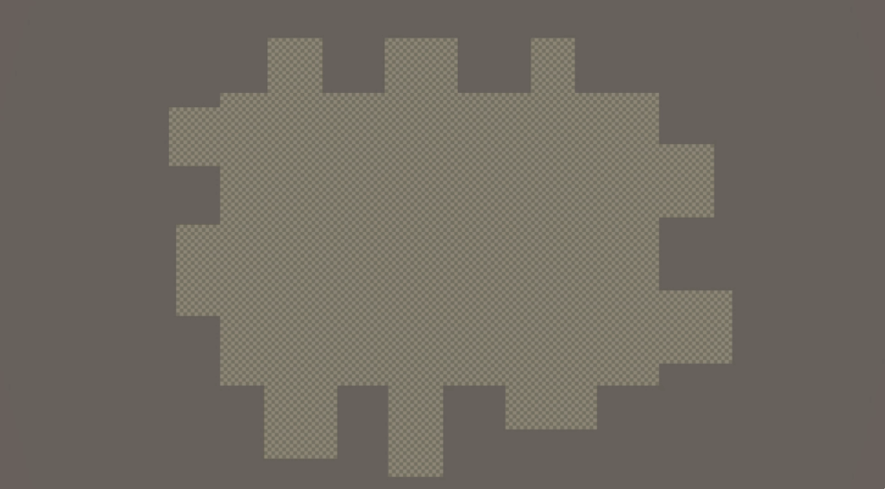

# Summary

This 2D (looking down on a 3D world) game is meant to simulate path finding and collision resolution.

At the start, there are 3-4 L shaped obstacles that spawn. These shapes vary in size and orientation.

You can then select how many agents you would like to have.

Each agent is meant to get to their destination, after this is done, a new destination is selected and the agent must reach their new destination.

Agents and their respective destinations are represented by matching colors. 

Agents use a modified version of A* path finding on a visibility graph that has been efficiently generated. 

Whenever agents collide, they must move away from each other and calculate a new path to their destination.

### This game showcases how to efficiently find paths and fix collisions.

Despite this being the main purpose of this simulation, the game lags/freezes when we do many agents, such as 12+. 

This also depends on your graphic cards, but on an RTX 3080, it would still freeze when using many agents.

Preview of a collision resolution

