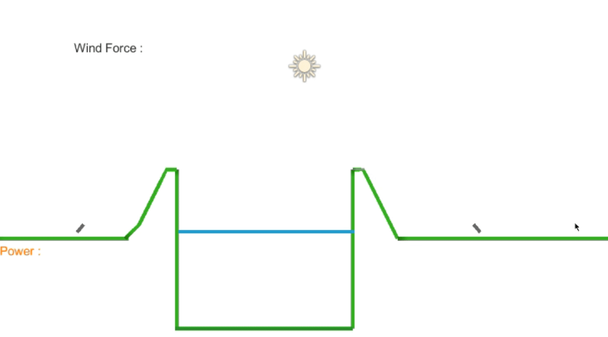

# Summary

This is 2D game where there are two static cannons on each side of the terrain, seperated by a mountain and water.

The cannonballs can be shot at different power as well at a different angle.

The cannonballs can collide with terrain and bounce back depending on the force of impact. 

All the physics is entirely simulated by using vector direction computations.

There are also balloons that spawn from the lake and that are impacted by a wind factor as soon as they're above the mountains.

The balloons are meant to be using [verlet contraints](https://en.wikipedia.org/wiki/Verlet_integration). However, this feature is buggy.

Cannonballs are not affected by the wind.

If a cannonball collides with a balloon, they are despawned.

The terrain is also pseudo randomly generated recursively with [perlin noise](https://en.wikipedia.org/wiki/Perlin_noise).

### This project highlights physics simulation by raycasting collisions and efficiently calculating a new trajectory based on the angle and power of collision, as well as a perlin noise generated 2D terrain.

Preview of gameplay

